# NaviCampus

<div align="center">
  
  <h3>Campus Navigation System for Educational Institutions</h3>
</div>

## 📝 Overview

NaviCampus is a comprehensive cross-platform mobile application designed to simplify navigation within Indian university and college campuses. The application provides indoor and outdoor navigation services, helping students, faculty, and visitors find their way around campus facilities efficiently.

By combining Google Maps integration for outdoor navigation with Wi-Fi triangulation for precise indoor positioning, NaviCampus offers a seamless navigation experience across the entire campus. The application also integrates with academic schedules to provide real-time information about room availability and bookings.

## 🏆 Key Features

### ✅ Implemented Features
- **📅 Smart Class Scheduling**: 
  - Interactive timetable grid with Monday-Friday, 7-period support
  - Period management (9:15 AM - 5:00 PM with lunch 12:15-1:15 PM)
  - Add/Edit/Delete classes with conflict detection
  - Visual week/day view with seamless transitions
  - Location linking preparation for map integration
- **🌐 Multilingual Support**: 
  - Full English and Hindi interface implementation
  - Context-aware translations for schedule features
  - Localized time and date formatting
- **💾 Data Management**: 
  - Persistent storage using AsyncStorage
  - Schedule data persistence with Zustand
  - User preferences and settings management

### 🔄 In Progress
- **🧭 Map Integration**: 
  - Map markers for key campus locations (60% complete)
  - Indoor/outdoor mode toggle implementation (45% complete)
  - Location services setup (40% complete)
- **🔍 Location Features**: 
  - Schedule-to-location linking (70% complete)
  - Room search functionality (65% complete)
  - Building information display (55% complete)
- **💫 UI Enhancements**: 
  - Loading indicators implementation (50% complete)
  - Transition animations (45% complete)
  - Accessibility improvements (40% complete)

### 📅 Planned Features
- **📲 Location-Based Alerts**: Smart notifications for class reminders and campus events
- **♿ Accessibility Features**: Screen reader support, high contrast mode, and text size options
- **🔌 Offline Support**: Full offline functionality with data caching

## 🛠️ Software Architecture

<details>
<summary>Click to view architecture details</summary>

### Architecture Diagram

```mermaid
flowchart TD
    subgraph Presentation["Presentation Layer"]
        UI["🖌️ UI Components"]
        Nav["🧭 Navigation\n(Expo Router)"]
        Screens["📱 Screens"]
        Local["🌐 Localization\n(EN/HI)"]
    end

    subgraph StateManagement["State Management"]
        Store["📦 Zustand Store\n- User preferences\n- Location data\n- Schedule data\n- Bookmarks\n- Notification settings"]
    end

    subgraph Storage["Persistent Storage"]
        Async["💾 AsyncStorage\n- User preferences\n- Bookmarks\n- Recent searches\n- Offline data"]
    end

    subgraph DataServices["Data Services"]
        LocationSvc["📍 Campus Location\nService"]
        ScheduleSvc["📆 Schedule Service"]
    end

    subgraph ExternalSvc["External Services"]
        Maps["🗺️ Google Maps API"]
        WiFi["📡 Wi-Fi\nTriangulation"]
    end

    Presentation --> StateManagement
    StateManagement --> Storage
    StateManagement <--> DataServices
    DataServices <--> ExternalSvc
```



### Design Patterns

NaviCampus follows these core architectural principles:

1. **🧩 Component-Based Architecture**: Reusable UI components for consistent design
2. **📦 State Management with Zustand**: Centralized application state with persistence
3. **🧭 Expo Router for Navigation**: File-based routing with dynamic route parameters
4. **🔧 Service Layer Pattern**: Separation of data access and business logic
5. **📚 Repository Pattern**: Abstract data sources for easier testing and maintenance

</details>

## 💻 Tech Stack

<details>
<summary>Click to see our comprehensive tech stack</summary>

NaviCampus leverages modern technologies to ensure a smooth and responsive user experience:

### Frontend
- **⚛️ React Native**: Cross-platform mobile application framework
- **📱 Expo**: Development framework and platform for React Native
- **📘 TypeScript**: Type-safe JavaScript for better code quality
- **🧭 Expo Router**: File-based navigation system
- **📦 Zustand**: Lightweight state management
- **💾 AsyncStorage**: Persistent client-side storage

### UI/UX
- **🧩 React Native Components**: Native UI components
- **🎨 Ionicons**: Icon library for consistent design language
- **🌓 Custom Theme System**: Support for light/dark modes and accessibility

### Backend & Services (Future Implementation)
- **🔥 Firebase**: Authentication, real-time database (planned)
- **🗺️ Google Maps API**: For outdoor navigation
- **📡 Indoor Positioning System**: Wi-Fi triangulation for indoor navigation

</details>

## 📱 Project Structure

<details>
<summary>Click to view project structure</summary>

```
app/               # Expo Router for file-based routing
  _layout.tsx      # Root layout component
  index.tsx        # Home screen
  map.tsx          # Campus map screen
  schedule.tsx     # Class schedule screen
  settings.tsx     # User settings screen
  location/        # Location screens
    _layout.tsx    # Location layout
    [id].tsx       # Dynamic location detail route

src/
  assets/          # Images, icons, etc.
  components/      # Reusable UI components
  hooks/           # Custom React hooks
  screens/         # Screen components
    LocationDetailScreen.tsx
    SearchScreen.tsx
  services/        # API and data services
    campusDataService.ts
  store/           # State management
    appStore.ts
  types/           # TypeScript types
  utils/           # Utility functions
```

</details>


## 🚀 Getting Started

<details>
<summary>Click for installation and setup instructions</summary>

### Prerequisites
- [Node.js](https://nodejs.org/) (v18 or higher)
- [npm](https://www.npmjs.com/) (v9 or higher)
- [Expo CLI](https://docs.expo.dev/get-started/installation/) (v53.0.9)
- [Expo Go](https://expo.dev/client) app on your iOS or Android device (for testing)

### Dependencies
```json
{
  "expo": "53.0.9",
  "expo-router": "5.0.7",
  "react": "19.0.0",
  "react-native": "0.79.2"
}
```

### Installation

1. Clone the repository
```bash
git clone https://github.com/Rudra00codes/NaviCampus.git
cd NaviCampus
```

2. Install dependencies
```bash
npm install
```

3. Start the development server
```bash
npx expo start
```

4. Run on your device
   - Scan the QR code with Expo Go (Android) or the Camera app (iOS)
   - Or run on simulator/emulator: `npm run android` or `npm run ios`

</details>

## 📘 User Guide

<details>
<summary>Click to expand user guide</summary>

### Navigation

#### 🏠 Home Screen
The home screen provides quick access to all primary features:
- Search bar for finding locations
- Quick access buttons for Maps, Schedule, Bookmarks, and Notifications
- Features section with detailed information about app capabilities

#### 🗺️ Campus Map
The map screen allows for seamless navigation around campus:
- Toggle between indoor and outdoor navigation modes
- Search for specific locations
- View nearby locations and their distances
- Enable Wi-Fi for precise indoor positioning

#### 📅 Class Schedule
The schedule screen provides comprehensive timetable management:
- Input and manage your weekly class schedule
- Seven periods per day (9:15 AM - 5:00 PM)
- Automatic lunch break (12:15-1:15 PM)
- Toggle between day and week views
- Edit or delete classes with tap and long-press
- Smart conflict detection for overlapping classes
- Seamless bilingual support (English/Hindi)

#### ⚙️ Settings
The settings screen offers customization options:
- Switch between English and Hindi languages
- Toggle dark mode
- Adjust text size for better readability
- Manage notification preferences
- Enable accessibility features

### Search Functionality
- Use the search bar to find buildings, rooms, or facilities
- Results show detailed information including building, floor, and room number
- View recent searches for quick access to frequently visited locations

### Bookmarking
- Save frequently visited locations for quick access
- Manage bookmarks through the Bookmarks screen

</details>

## 🎯 Development Roadmap

| Phase | Features | Status | Progress |
|-------|----------|--------|----------|
| MVP | Basic navigation system setup | ✅ Complete | 100% |
| Phase 1 | Schedule input & management | ✅ Complete | 100% |
| Phase 2 | Location search & bookmarking | 🔄 In Progress | 75% |
| Phase 3 | Map integration & navigation | 🔄 In Progress | 50% |
| Phase 4 | UI polish & offline support | 🔄 In Progress | 40% |
| Phase 5 | Location-based notifications | 📅 Planned | - |
| Phase 6 | User profiles & social features | 📅 Planned | - |

### Current Sprint (as of May 26, 2025)
- **✅ Completed**:
  - Interactive timetable grid implementation
  - Seven-period system with lunch break handling
  - Comprehensive schedule CRUD operations
  - Conflict detection and validation
  - Bilingual interface with full translations
  - Schedule data persistence
  - Visual day/week view transitions
  - Form validation and error handling

- **🔄 In Progress**:
  - Campus location data integration
  - Map markers and location services
  - Schedule-to-location linking system
  - Loading state indicators
  - UI polish and transitions
  - Indoor/outdoor navigation toggle

- **⏱️ Up Next**:
  - Offline data synchronization
  - Location-based notifications
  - Extended bookmark functionality
  - Search history optimization
  - Campus event integration
  - Advanced accessibility features

## 📄 License

This project is licensed under the MIT License - see the [LICENSE](./LICENSE) file for details.

## 📞 Contact

For questions or feedback about NaviCampus, please contact:
- Project Lead: [Your Email or Contact Information]
- GitHub Issues: Submit issues through the [GitHub repository](https://github.com/Rudra00codes/NaviCampus/issues)